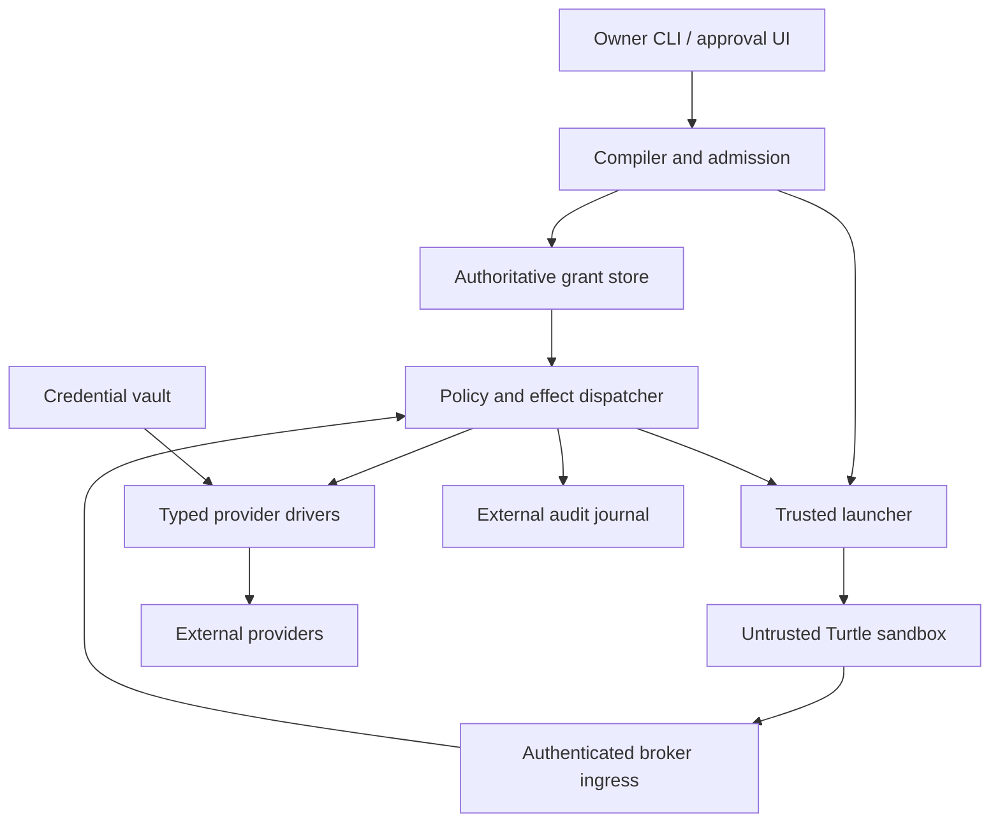
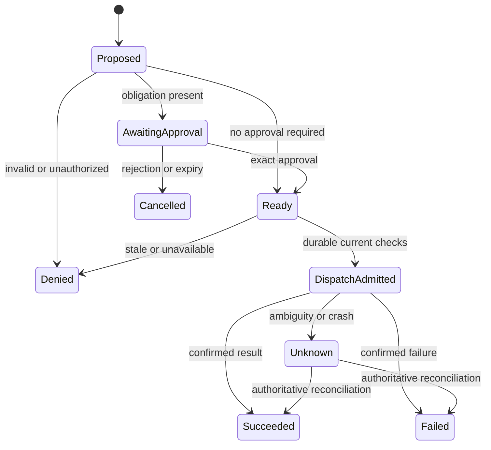

# SyberLabs Turtle System
## Authority envelopes for autonomous computation

**Design specification v0.1 · 18 September 2026**  
**Status:** Proposed architecture for review and implementation planning. No Turtle implementation, benchmark, security audit, or interoperability result is asserted by this document.  
**Target:** A single-host, Linux-first runtime with enforceable authority across local execution and brokered external effects.  
**Working name:** Turtle. Commercial naming is unresolved; it is not a technical dependency.

> A Turtle is a runtime-enforced authority envelope around a unit of computation. Its permissions belong to an authenticated execution instance, survive changes of model or framework, and cannot expand through delegation.

### Reading guide

Sections 1–4 establish the product decision and research basis. Sections 5–9 define the security contract. Sections 10–17 specify implementation boundaries and interfaces. Sections 18–23 define testing, operations, delivery, and outstanding decisions. The appendices provide worked traces, decision records, and a source register.

In this document, **MUST** and **MUST NOT** specify release requirements; **SHOULD** identifies a default that needs a documented reason to change. Examples describe proposed interfaces, not existing commands. Performance values are targets, not measurements. “Verified source” means inspected primary documentation or research, not independently audited vendor behavior.

---

## 1. Executive decision

Build **Turtle Runtime**, with a deliberately restricted first enforcement profile called `strict-local-v1`:

1. Each Turtle runs in its own sandbox, filesystem view, and network identity.
2. The sandbox receives no reusable provider credentials and no host control sockets.
3. External authority is exercised through typed, trusted brokers, not unrestricted internet access.
4. One canonical manifest compiles into the sandbox configuration, broker policy, delegation constraints, approval requirements, and accounting rules.
5. The compiler produces an **enforcement report**. A deployment is admitted only if every required constraint has an identified enforcement mechanism.
6. Delegation creates another isolated execution instance, preserves correlated permissions, and charges a shared authority-domain budget.
7. Decisions, dispatches, uncertain outcomes, and policy changes are recorded outside the agent boundary.

The first useful workflow is a repository worker: inspect a selected source snapshot, change selected directories, run tests, and propose a patch. A separate, narrowly privileged publisher can perform an exact approved external operation through a typed adapter. Publishing is a later gate than offline patch generation.

Do not start with a marketplace plugin that merely advises peer plugins. Such a plugin cannot enforce behavior on paths the platform does not route through it. Do not start with a distributed identity network, an unrestricted browser, or a general resource-acquisition system.

**The differentiated hypothesis is not “a sandbox plus an MCP proxy.”** It is that an inspectable authority contract can remain consistent across multiple enforcement planes, nested execution, and concurrent effects—and that developers will value the resulting evidence enough to adopt it. This hypothesis still requires comparative testing and customer evidence.

## 2. What the research changes

### 2.1 Corrections and qualifications to the supplied concept note

| Original premise | Finding | Consequence |
|---|---|---|
| A blocked connector may remain reachable through another plane | Verified in Cursor’s Grok Bot security FAQ: shared per-user computer access and separate connector/network controls are documented. | Keep cross-plane bypass prevention as a concrete motivating case. |
| No one meaningfully combines the relevant layers | Too strong. Docker documents a sandbox with an external network proxy, credential injection, and host-side MCP gateway. | Turtle must outperform a serious combined baseline; packaging alone is insufficient. |
| Delegation attenuation is a new agent primitive | Attenuation has substantial prior art, including Macaroons and Biscuit, as well as recent agent-specific work. | Claim an implementation and usability contribution, not invention of attenuation. |
| The IETF work establishes a settled protocol | The cited delegation-chain document is an Internet-Draft. | Track it; do not freeze an unstable draft into the v0 wire protocol. |
| A proxy study establishes general agent containment | The cited paper concerns tool-selection/access control in a bounded MCP setting. | Never generalize its results to shell, browser, network, or malicious provider behavior. |
| AcquireBound is close to Turtle’s advanced direction | Verified as a recent preprint addressing acquired resources and activation authority. Its results depend on explicit mediation and provider-evidence assumptions. | Credit the overlap and defer general acquisition support. |
| Named competitors and funding amounts justify the business | Some assertions were not independently established in this research. | Omit funding-based market sizing and unsupported feature comparisons. |

Sources: [Cursor security FAQ](https://cursor.com/docs/grok-bot/security-faq), [Docker architecture](https://docs.docker.com/ai/sandboxes/architecture/), [Macaroons](https://research.google/pubs/macaroons-cookies-with-contextual-caveats-for-decentralized-authorization-in-the-cloud/), [Biscuit](https://www.biscuitsec.org/), [delegation-chain draft](https://www.ietf.org/archive/id/draft-asor-wimse-agent-delegation-chain-01.html), [Prompts Don’t Protect](https://arxiv.org/abs/2605.18414), [AcquireBound](https://arxiv.org/html/2609.14744v1).

The Turtle Auth URL resolved without inspectable page content in this research. Its current product status and exact feature set remain unverified here. Name clearance is a separate task. The exact Microsoft “MCP Security Gateway” feature bundle from the attachment was not verified; the accessible Microsoft MCP Gateway repository describes a reverse proxy and management layer. These are not interchangeable claims. [Microsoft repository](https://github.com/microsoft/mcp-gateway).

### 2.2 Security foundations and their relevance

**Reference monitor and least privilege.** Turtle applies established security principles to autonomous execution: mediate protected operations, keep enforcement inaccessible to the subject, minimize trusted mechanisms, and fail safely. The intellectual antecedent is classical operating-system protection, not a special property of language models. [Saltzer and Schroeder](https://web.mit.edu/saltzer/www/publications/protection/).

**Object capabilities and attenuation.** An execution instance should receive only explicit ways to affect its environment. Macaroons demonstrate contextual restriction of delegated credentials; Biscuit supports public-key verification and offline attenuation. Neither token format automatically confines a process that retains unrelated credentials or network routes. Turtle v0 uses server-side grants because local revocation and accounting already require authoritative state. [Macaroons](https://research.google/pubs/macaroons-cookies-with-contextual-caveats-for-decentralized-authorization-in-the-cloud/), [Biscuit](https://www.biscuitsec.org/).

**Policy evaluation is not identity or enforcement.** Cedar evaluates authorization requests; it does not establish the authenticity of request attributes or prevent bypass. AWS’s multi-agent example separates originating-user authorization, delegation, and agent-to-tool checks. Turtle makes the same separation, while adding execution containment and a restricted delegation algebra. [AWS Cedar architecture](https://aws.amazon.com/blogs/security/enforce-least-privilege-authorization-in-multi-agent-ai-chains-using-cedar/).

**Consistency matters.** Zanzibar shows why authorization must account for ordering between access changes and object state. Turtle does not need Zanzibar’s distributed scale, but it does need explicit policy revisions, resource preconditions, and a precise revocation boundary. [Zanzibar](https://research.google/pubs/zanzibar-googles-consistent-global-authorization-system/).

**Workload identity is a separate layer.** SPIFFE offers a workload identity model and verifiable identity documents. A stable identity is useful for a future multi-host Turtle deployment, but identity alone does not answer what the workload may do. [SPIFFE overview](https://spiffe.io/docs/latest/spiffe-about/overview/).

**Isolation does not determine business semantics.** gVisor reduces exposure to the host system API. Its documentation explicitly distinguishes sandboxing from a secure overall architecture. A sandbox allowed to call a broad cloud API can still exercise broad cloud authority. [gVisor security model](https://gvisor.dev/docs/architecture_guide/security/).

### 2.3 Standards decisions

| Standard or mechanism | What it supplies | Turtle decision |
|---|---|---|
| MCP authorization | Authorization machinery for HTTP transport | Support a pinned protocol revision; do not treat transport authorization as resource-level authorization. |
| OAuth token exchange, RFC 8693 | Delegation/impersonation token exchange | Optional provider integration; actor history is not an attenuation proof. |
| OAuth security BCP, RFC 9700 | Current security guidance | Apply to broker-owned provider login and token handling. |
| Rich Authorization Requests, RFC 9396 | Structured authorization details | Future interoperability mapping; retain Turtle’s explicit correlated clauses internally. |
| DPoP, RFC 9449 | Sender-constrained HTTP access tokens | Future external API option, not a substitute for sandbox isolation. |
| Agent Delegation Chain draft | Proposed linked attenuated token chains | Experimental later adapter only, with exact draft version recorded. |
| JSON Canonicalization Scheme, RFC 8785 | Deterministic JSON representation | Use for digest inputs after strict schema validation. |
| Linux namespaces, cgroups, sandbox runtime | Process/resource containment mechanisms | Backend mechanisms, never descriptions of application authority by themselves. |

References: [MCP authorization](https://modelcontextprotocol.io/specification/2025-11-25/basic/authorization), [RFC 8693](https://www.rfc-editor.org/rfc/rfc8693), [RFC 9700](https://www.rfc-editor.org/rfc/rfc9700), [RFC 9396](https://www.rfc-editor.org/rfc/rfc9396), [RFC 9449](https://www.rfc-editor.org/rfc/rfc9449), [draft](https://www.ietf.org/archive/id/draft-asor-wimse-agent-delegation-chain-01.html), [RFC 8785](https://www.rfc-editor.org/rfc/rfc8785), [cgroup v2](https://docs.kernel.org/admin-guide/cgroup-v2.html).

### 2.4 Competitive baseline and build-versus-buy

| Baseline | Verified relevance | What the Turtle experiment must add |
|---|---|---|
| Docker Sandboxes | Network proxy, credential injection, workspace isolation options, MCP gateway | Demonstrable consistency of grants across those planes and descendants; no assumption that Docker lacks it without testing. |
| MCPProxy | Scoped agent tokens, profiles, quarantine, optional isolation for local servers | Containment of non-MCP paths and coherent delegation/accounting semantics. |
| AWS Cedar reference architecture | Layered multi-agent authorization | Local runtime containment and a portable, inspectable policy contract. |
| gVisor / Firecracker | Isolation substrates with different operational trade-offs | Typed external-effect authorization and evidence, built on rather than replacing isolation. |
| AcquireBound | Activation controls for acquired authority | A narrower, practical runtime with explicit unsupported cases; not an uncredited reimplementation of the paper. |

Sources: [Docker](https://docs.docker.com/ai/sandboxes/architecture/), [MCPProxy](https://mcpproxy.app/), [AWS](https://aws.amazon.com/blogs/security/enforce-least-privilege-authorization-in-multi-agent-ai-chains-using-cedar/), [gVisor](https://gvisor.dev/docs/architecture_guide/security/), [Firecracker](https://firecracker-microvm.github.io/), [AcquireBound](https://arxiv.org/html/2609.14744v1).

**Decision:** Build the authority compiler, reference semantics, admission controller, effect dispatcher, and conformance suite. Reuse an existing isolation runtime, cryptographic libraries, database, TLS implementation, and protocol parsers. Do not write a hypervisor, OAuth server, or general-purpose policy language.

## 3. Product contract and scope

### 3.1 User and job

Initial user: an engineer or small platform team running code-capable agents over selected repositories and SaaS accounts. They need a reliable answer to: “What can this run reach, through which paths, and what changes when it delegates?”

Primary jobs:

- Run an unfamiliar or compromised agent without exposing the rest of the workstation.
- Grant repository-specific business actions without exposing a general provider token.
- Restrict a worker below the orchestrator’s authority.
- Explain denials and inspect the actual deployed boundary.
- Revoke a run and determine which operations might already have escaped cancellation.

### 3.2 Release stages

| Stage | Capability | Claim ceiling |
|---|---|---|
| P0: semantic prototype | Pure policy evaluator, delegation checker, simulated budgets | No containment claim. |
| P1: contained worker | Linux sandbox, snapshot filesystem, no raw internet, inference broker, patch output | Local execution containment within tested backend assumptions. |
| P2: brokered effects | Curated MCP tools, exact approvals, one provider adapter, audit/recovery | Resource-scoped authorization for named adapter operations. |
| P3: recursive runtime | Isolated children, ancestor policy checks, aggregate budgets, cascade revocation | Attenuation and aggregate accounting within one host/domain. |
| P4: production candidate | Independent review, fault testing, documented compatibility, operations | Only claims established by the released conformance results. |

The specification covers P0–P4. P1 is the first demonstration; P3 is the first complete Turtle System candidate. A date is not a substitute for passing these gates.

### 3.3 Explicit exclusions

v0 does not provide fine-grained authenticated browser control, arbitrary TCP/UDP access, SSH-agent forwarding, host Docker access, credential export, cross-organization delegation, arbitrary remote MCP server certification, multi-tenant hostile hosting, distributed consensus, payments, account creation, cloud resource acquisition, or general information-flow noninterference.

A future compatibility mode may expose broader channels. It must be a separately named profile with different claims. There is no silent fallback from `strict-local-v1`.

## 4. Definitions and conceptual model

| Term | Definition |
|---|---|
| Agent | Untrusted program, potentially driven by a model. Not an authorization principal merely because it has a name. |
| Turtle | One authenticated execution instance and its effective authority envelope. |
| Root grant | Authority explicitly admitted by the owner, bounded by administrator policy. |
| Authority domain | A root grant and all descendants sharing aggregate constraints. |
| Shell | Informal metaphor for the envelope; not the Unix shell executable. |
| Manifest | Owner-authored requested policy; inert until admitted. |
| Grant | Immutable admitted permissions plus identity, lineage, expiry, and revision bindings. |
| Effect | A typed operation at a protected boundary: file export, repository mutation, inference request, child launch, etc. |
| Driver | Trusted translation from a typed effect to backend-specific enforcement or execution. |
| Permit | Internal single-use authorization record for one exact dispatch. Not a reusable provider credential. |
| Enforcement report | Machine-readable mapping from requested constraints to deployed mechanisms and limitations. |
| Receipt | Evidence that the monitor observed a decision or result; not automatic proof of remote reality. |

The original tuple of identity, tools, files, network, execution, credentials, resources, budgets, delegation, and lifetime remains useful as a UI inventory. It is insufficient as the full mathematical model because permissions across dimensions are correlated.

For example, “read repository A using credential X” and “write repository B using credential Y” must not turn into “read or write either repository using either credential.” Turtle represents complete authority clauses, not independent lists whose Cartesian product accidentally grants more power.

## 5. Threat model and assurance boundary

### 5.1 Attacker capabilities

Assume the adversary controls all agent decisions, tool arguments, shell commands, child requests, local scripts, dependency code executed inside the sandbox, and text returned by untrusted inputs. Assume agents may collude, replay requests, race revocation, exhaust resources, forge self-reported roles, and intentionally seek credentials.

Do not rely on system prompts, model alignment, command descriptions, filenames, tool “read-only” annotations, or claims such as “the user already approved this.” Assume a permitted read can return malicious instructions.

### 5.2 Trusted computing base

The TCB includes the host OS and hardware, selected sandbox runtime and its host helpers, privileged launcher, policy compiler/evaluator, identity binding, database, effect dispatcher, credential broker, and each adapter implementation handling protected operations. Provider enforcement is trusted to the extent stated in the adapter contract.

The inference model, agent framework, workspace source code, and untrusted tool output are outside the TCB. A third-party plugin is not automatically trusted because it uses MCP or runs in a container.

An approved remote server that already owns broad credentials may perform undeclared side effects on its own. Turtle cannot prevent those by filtering its tool names. Such a server cannot qualify for strict semantic enforcement unless its authority and behavior are confined by an independently adequate boundary.

### 5.3 Assets

- Host files, session material, signing keys, and unrelated accounts.
- Provider credentials and their ability to exercise rights.
- Integrity of selected repositories and authorized output destinations.
- Budget capacity, approval decisions, lineage, and revocation state.
- Confidential workspace content, subject to explicitly admitted output recipients.
- Audit integrity against the sandboxed subject.

### 5.4 Qualified security claim

For a successfully admitted strict-profile run, every **supported protected external operation initiated through that run’s exposed interfaces** must either pass the trusted dispatch checks or be blocked by the deployed containment boundary.

This claim assumes an uncompromised TCB and accurately implemented adapter semantics. It excludes hardware covert channels, kernel/runtime vulnerabilities, owner mistakes, malicious providers acting independently, and human execution of exported malicious code.

“No side doors” is a design objective with a declared scope, not a proof about every possible action on the internet.

### 5.5 Authority confinement versus data confidentiality

Suppose a Turtle can read a private document and create an issue in an allowed public repository. Each individual action can be authorized while their composition leaks the document. Likewise, an inference endpoint is an authorized recipient of prompt content even if the model API key stays hidden.

v0 therefore requires an explicit **disclosure envelope**: a conservative upper bound on data classes the run can read, paired with permitted recipient classes for every output channel. It rejects clearly incompatible configurations at admission. It does not track semantic information flow through arbitrary computation, prove successful redaction, or claim that allowed recipients cannot redistribute data.

Within one Turtle, treat every output as potentially containing all information already available to it. Labels are owner- or trusted-importer-assigned, never agent-assigned. A digest does not erase confidentiality. Approval is required for declassification when a workflow crosses the declared recipient boundary; a model’s assurance is insufficient.

## 6. Authority semantics

### 6.1 State and requests

Define a Turtle as:

`T = (id, root_id, parent_id, subject_binding, G, B, D, L, E, profile)`

- `G`: finite set of correlated grant clauses.
- `B`: budget ceilings and references to shared accounting ledgers.
- `D`: delegation limits and allowed child templates.
- `L`: lifetime bounds.
- `E`: revision/epoch bindings for policy, resource registry, and runtime.

An effect request is normalized to:

`q = (subject, action, resource, credential_binding, arguments_digest, recipient, provenance, preconditions)`.

The monitor derives `subject`, resource identity, and credential binding from trusted state. Caller-supplied identifiers are selectors to verify, not authority facts.

### 6.2 Authorization predicate

For current state `s`, dispatch is eligible only when:

`Eligible(T,q,s) = Active(T,s) ∧ AncestorsActive(T,s) ∧ MatchAllLayers(T,q,s) ∧ AdapterValid(q,s) ∧ DisclosureAllowed(T,q,s) ∧ ApprovalValid(q,s) ∧ BudgetReservable(T,q,s)`.

All conjuncts are mandatory. Unknown, malformed, unsupported, stale, or errored evaluation is ineligible. Eligibility alone is not a dispatch permit; the stateful transaction in section 13 must still succeed.

Within one policy layer, a matching complete allow clause is necessary and every matching deny overrides it. Across administrator, owner, and ancestor layers, permission is intersection. A later permit cannot override an earlier deny. The agent may request less authority, never establish new facts about its own authority.

### 6.3 Restricted clause algebra

Each clause binds these fields together:

`(action, resource_set, credential_ref, recipient_set, constraints, obligations)`.

v0 constraint forms:

| Form | Allowed representation | Attenuation rule |
|---|---|---|
| Resource membership | Exact IDs in a bounded set | Child set is a subset. |
| Action membership | Registered action IDs | Child set is a subset. |
| Numeric maximum | Nonnegative bounded integer | Child maximum is no greater. |
| Numeric minimum | Nonnegative bounded integer | Child minimum is no smaller. |
| Exact field | Typed scalar | Equal or more restrictive by registered adapter semantics. |
| Path subtree | Normalized relative path segments within a snapshot | Child is beneath parent; never textual prefix matching. |
| Recipient membership | Registry IDs, not display names | Child set is a subset. |
| Required approval | Typed approval obligation | Child retains or strengthens it. |
| Expiry | Absolute deadline plus monotonic timer | Child expires no later than parent. |

No arbitrary regex, user code, network-dependent policy predicate, or unrestricted logical theorem proving is accepted in child grants. Each child clause must have one parent clause that subsumes it; this conservative check may reject valid but complex unions. Refuse rather than guess.

Runtime checks also evaluate the live ancestor chain. A static subset check cannot account for later revocation or changed administrative restrictions.

### 6.4 Attenuation and aggregate limits

For supported effect semantics, require:

`Allowed(child,s) ⊆ Allowed(parent,s)`.

This does not imply that several children jointly stay below a budget. For each shared domain counter:

`spent(domain) + reserved(domain) ≤ ceiling(domain)`.

An operation must reserve at every applicable ancestor limit in a single database transaction. Do not sum overlapping ancestor reservations to report domain totals; store one operation debit with references to the limits it consumes. Local child ceilings coexist with the root ceiling. Creating another child or another request ID does not replenish either.

Example: a root with 100 provider attempts and two children each capped at 80 still allows at most 100 attempts across the entire domain, including the root itself.

### 6.5 Delegation is not privilege separation inside one process

Two model conversations inside the same process or writable filesystem are one security domain unless isolated otherwise. A child principal requires its own sandbox and authenticated channel. A parent can voluntarily give a child data or act on its messages; Turtle does not promise that a less-privileged child cannot persuade a more-privileged parent to use the parent’s legitimate authority.

If that interaction matters, run the orchestrator with low authority and place consequential actions behind an independent approver or narrow deterministic service. Do not expose a broad “ask parent to do anything” RPC and call it attenuation.

## 7. Normative invariants

| ID | Requirement | Evidence required |
|---|---|---|
| INV-01 | Unspecified protected authority is denied. | Negative policy fixtures and raw-call attempts. |
| INV-02 | Runtime identity cannot be chosen by request payload. | Identity spoofing and channel-crossing tests. |
| INV-03 | Effective policy and credential stores are outside the sandbox. | Mount, process, FD, and socket inspection. |
| INV-04 | Supported external effects traverse approved brokers. | Packet capture plus direct-path adversarial tests. |
| INV-05 | Provider secrets are not delivered to the agent. | Environment, filesystem, error, response, and log tests. |
| INV-06 | Child authority does not exceed any ancestor. | Algebra properties and integration tests. |
| INV-07 | Shared limits survive fan-out, retries, and crashes. | Concurrent reservation and recovery tests. |
| INV-08 | Approval binds one exact effect and cannot create a policy grant. | Payload mutation, replay, expiry, and wrong-subject tests. |
| INV-09 | Revocation blocks new dispatch admission after its serialized fence. | Ordered race traces; in-flight effects reported separately. |
| INV-10 | Unknown enforcement support prevents launch. | Backend feature-loss and version-change tests. |
| INV-11 | Audit intent is durable before consequential dispatch. | Crash injection before/after every persistence boundary. |
| INV-12 | Exported artifacts do not execute automatically on the host. | Malicious hooks, symlinks, archives, and terminal-output tests. |
| INV-13 | All supported output channels are included in disclosure admission. | Model, tool, child-message, audit, and artifact checks. |

These are implementation obligations. None is marked satisfied by writing this specification.

## 8. Architecture and trust boundaries



All sandbox network routes terminate at the broker ingress or are dropped. The diagram’s arrows are allowed communication paths, not proof that implementation enforces them.

### 8.1 Components

| Component | Responsibility | May hold secrets? |
|---|---|---|
| `turtle` CLI | Owner commands, manifest inspection, approvals | Owner session only; no agent access. |
| `turtled` | Admission, lifecycle, grant tree, serialized dispatch | Internal signing/session material. |
| Policy library | Normalize, evaluate, attenuate, explain | No provider secrets. |
| Launcher helper | Create/terminate confined sandboxes and network attachments | No provider secrets. |
| Broker ingress | Bind transport to Turtle identity; enforce request limits | Per-instance session material only. |
| Typed drivers | Validate exact resource/action and dispatch | Narrow provider credentials when necessary. |
| Vault | Persist provider credentials; release only to approved drivers | Yes; isolated from workloads. |
| Audit/export service | Journal decisions and package artifacts | Redacted records; no provider secrets. |

The first implementation may combine policy, database, and dispatch in one Rust daemon to simplify consistency. Separate processes are justified for privilege separation, especially the launcher and credential-handling drivers—not for a microservice aesthetic.

### 8.2 Technology decisions

- **Rust** for policy, daemon, CLI, and trusted adapters: shared types, bounded parsing, and memory safety in the new TCB.
- **SQLite in WAL mode**, local filesystem, full durability for security state; one daemon owns writes. No network filesystem, multiple active leaders, or distributed workers in v0.
- **Linux OCI sandbox through gVisor `runsc`**, with pinned release and tested configuration. No host networking, privileged container, or agent-visible runtime socket.
- **Read-only source snapshots and isolated writable directories** rather than direct writes into the owner’s checkout.
- **Standard TLS and cryptographic libraries**; opaque stateful grants internally. No custom delegation cryptography.
- **JSON Schema plus a strict YAML frontend**; a bounded internal policy representation rather than arbitrary user-authored Cedar/Rego in the enforcement kernel.

Alternatives: Firecracker is a credible later backend where its operational requirements are appropriate. A namespace/Landlock implementation is a useful later local profile, but its exact feature support must be tested. Landlock’s documented ABI differences and file-descriptor behavior mean “Linux supports Landlock” is not a sufficient security admission check. [Firecracker](https://firecracker-microvm.github.io/), [Landlock documentation](https://docs.kernel.org/userspace-api/landlock.html).

Cedar is a candidate for an administrator-policy layer later. If adopted, Turtle must reject authorization responses containing relevant evaluation errors: Cedar documents skip-on-error semantics, which do not by themselves meet Turtle’s fail-closed contract. OPA is another possible integration, but arbitrary policy expressiveness is deliberately outside the v0 attenuation algebra. [Cedar semantics](https://docs.cedarpolicy.com/auth/authorization.html), [OPA policy language](https://www.openpolicyagent.org/docs/policy-language).

## 9. Policy manifest and compiler

### 9.1 Example manifest

The following is a proposed policy for a worker that edits a source snapshot and uses brokered inference and repository reads. Registry references are locally administered aliases resolved to immutable IDs and digests at admission; they are not secret values or caller-controlled URLs.

```yaml
apiVersion: turtle.syberlabs.space/v0alpha1
kind: TurtlePolicy
metadata:
  name: rise-worker
spec:
  profile: strict-local-v1
  runtime:
    imageRef: registry:node-worker-v1
    argv: ["/opt/agent/bin/worker"]
    cwd: /workspace/repo
    shell: true
  lifetime:
    maxSeconds: 1800
  filesystem:
    snapshotRef: registry:rise-reviewed-source
    mountAt: /workspace/repo
    writableSubtrees: [src, tests]
    scratchMiB: 512
    exportSubtrees: [src, tests]
  network:
    mode: broker-only
    rawDestinations: []
  data:
    readableClasses: [internal-source]
    recipients: [owner-local, approved-inference-provider, approved-code-provider]
  credentials:
    bindings: [inference-project, github-rise-read]
    export: false
  grants:
    - id: infer
      action: inference.generate
      resource: registry:approved-model
      credential: inference-project
      recipients: [approved-inference-provider]
      constraints:
        maxInputBytes: 262144
        maxOutputTokens: 4096
    - id: read-source
      action: github.repository.read
      resource: registry:rise-repository
      credential: github-rise-read
      recipients: [owner-local, approved-code-provider]
      constraints:
        maxResponseBytes: 1048576
  mcp:
    enabledTools: [github_repository_read]
    resourceReads: false
    prompts: false
    sampling: false
    elicitation: false
    asyncTasks: false
  limits:
    domain:
      providerAttempts: 500
      externalMutations: 0
      inferenceOutputTokens: 50000
      outboundPayloadBytes: 16777216
      memoryMiB: 4096
      pids: 256
      cpuMillisPerSecond: 2000
    local:
      memoryMiB: 2048
      pids: 128
      cpuMillisPerSecond: 2000
  delegation:
    maxDepth: 1
    maxLiveChildren: 2
    maxTotalDescendants: 4
    allowedTemplates: [registry:read-only-reviewer]
  audit:
    required: true
    payloadMode: digest-and-metadata
```

`github.repository.read` is a Turtle action implemented by a curated driver, not a promise that every GitHub MCP server has that tool. Each field above is part of the proposed schema. Production examples must additionally ship the matching registry fixtures so they are runnable without invented IDs.

Recipient declarations include the upstream provider even for reads: request paths, arguments, and queries can transmit data. `approved-code-provider` must be approved for `internal-source` in the owner registry. The static admission check verifies the run’s readable classes against every declared channel recipient, including owner storage, inference, tool providers, child messages, and remote audit sinks if enabled.

### 9.2 Parsing and defaults

- Reject duplicate keys, unknown fields, YAML custom tags, merge keys, aliases, non-finite numbers, and ambiguous scalar coercion.
- All quantities have explicit units and bounded ranges. No float money values. Durations are integer seconds, byte limits are integers, and IDs are normalized UTF-8 strings with stricter ASCII syntax for action/registry identifiers.
- Missing optional grants or channels mean empty/disabled. Missing mandatory profile, lifetime, or resource fields is an error.
- No string interpolation, shell expansion, remote includes, or agent-selected policy URLs.
- A repository’s `turtle.yaml` is a proposal. Only the authenticated owner control plane can admit it.
- Reject overlapping writable roots and unsupported negative subpath rules. A policy cannot declare a directory writable and then assume arbitrary deeper exceptions work.

Initial parser limits are 256 KiB per manifest, 128 grant clauses, 64 resource IDs per clause, 32 constraint fields per clause, 64 path roots, and 16 levels of input nesting. Runtime maximum delegation depth is four even if a manifest requests more. Reject excess instead of truncating. Request bodies default to 1 MiB, with smaller adapter limits taking precedence; the inference example imposes 256 KiB. These are explicit engineering defaults, to be revised through versioned profiles after measurement.

### 9.3 Compilation pipeline

1. Parse and validate the manifest.
2. Resolve image, snapshot, resource, credential, recipient, and driver references from the trusted registry.
3. Preserve complete correlated clauses; canonicalize validated JSON using JCS and hash the result.
4. Intersect owner request with administrator policy and, for children, every ancestor ceiling.
5. Verify backend capabilities and driver contracts; reject missing enforcement.
6. Check disclosure compatibility across all admitted channels.
7. Produce an immutable plan: mounts, network topology, driver grants, budgets, lifecycle parameters, and expected enforcement evidence.
8. Create the sandbox in a frozen/unstarted state; inspect actual configuration against the plan.
9. Commit grant, plan digest, and instance binding; enable the admitted broker channel; start execution.

Any failed step tears down provisional resources. A partial launch is not a weaker successful launch.

### 9.4 Enforcement report

For each requirement, record `constraint_id`, `plane`, `mechanism`, `backend_version`, `status`, `test_profile`, and `limitation`. Status is one of `enforced`, `unsupported`, `not_requested`, or `external_assumption`.

Example: repository write exclusion maps to “no mutation grant + no raw network + no provider token + isolated workspace”; an unregistered browser session maps to “unsupported, launch rejected.” Unknowns are not rendered green. The report must distinguish reviewed configuration from live attestation; v0 supplies local configuration evidence, not hardware attestation.

## 10. Execution, filesystem, and artifact boundary

### 10.1 Sandbox construction

The launcher MUST provide isolated PID, mount, IPC, user, and network environments using the certified backend configuration. The runtime image is immutable and contains only the declared agent/toolchain. The workload has no host-root identity, device access beyond an explicit minimal set, host namespace attachment, host service discovery, or ability to alter its own network configuration.

Drop unnecessary capabilities, set `no_new_privs`, and apply the runtime’s supported syscall restrictions. Disallow privilege escalation, host `ptrace`, arbitrary mounts, device creation, BPF administration, and runtime-control APIs. Seccomp reduces a syscall surface; it is not the business authorization mechanism. [Linux seccomp documentation](https://docs.kernel.org/userspace-api/seccomp_filter.html).

Before executing untrusted code, close inherited file descriptors except documented standard streams and broker connections. Sanitize the environment with an allowlist. Do not inherit SSH agents, cloud credentials, proxy credentials, Git credential helpers, host package credentials, display sockets, browser-debugging sockets, or the owner’s home directory.

A shell is permitted inside the boundary. Command allowlists do not substitute for containment: Python, Node, and compilers can reproduce most effects of `curl` or a shell builtin. Framework command policies are additional restrictions, not Turtle’s boundary.

### 10.2 Filesystem layout

| Path | Role | Access |
|---|---|---|
| `/usr`, `/opt/agent` | Pinned image/toolchain | Read-only; executable where required. |
| `/workspace/repo` | Selected sanitized source snapshot | Read-only except separately materialized writable subtrees. |
| `/workspace/repo/src`, `/workspace/repo/tests` | Example private work areas | Writable only when declared. |
| `/tmp`, `/home/agent` | Per-instance scratch | Writable, quota-limited, destroyed at teardown. |
| `/run/turtle` | Workload ingress metadata | Minimal; no management socket or root credentials. |
| `/proc` | Sandboxed process view | No host process information. |

Strict v0 does not bind-mount the owner’s live repository. The importer copies an explicitly selected file set to a new snapshot, resolves paths safely, strips unapproved metadata, and never preserves links to host inodes. It excludes host credential/configuration directories and repository internals unless separately supported. Ignore rules are not a secret boundary. Secret scanning is advisory; the owner must review the import set.

v0 imports regular files and directories only. Symlinks, hard-link relationships, devices, sockets, FIFOs, and archive entries of these types are rejected or converted through an explicit safe import. Writable subtrees are independent private copies with immutable parent mount points. Backend tests must establish that renaming a mount point or writing an ancestor cannot bypass the boundary.

Kernel/runtime access checks enforce local reads and writes. The daemon does not ask an LLM to authorize every syscall. Within a writable subtree the workload may modify or delete its files; the interface must say so.

### 10.3 Path resolution

Host import/export code uses directory-relative operations with a trusted root handle. Linux `openat2` resolution controls can reject escapes, symlinks, and magic links; use appropriate beneath-root/no-link flags and fail if the required primitive is unavailable. Canonicalizing a string and later opening it is insufficient against races. [Linux `openat2` manual](https://man7.org/linux/man-pages/man2/openat2.2.html).

Input paths are relative normalized segments. Reject traversal, NUL, absolute paths, and case-collision ambiguity. The importer never follows `.git` configuration or executes repository hooks.

### 10.4 Outputs are another trust boundary

The agent writes into private storage. `turtle export` creates a bounded artifact of allowed regular-file changes, with hashes, deletions, modes, and originating policy. Freeze the workload or snapshot output before hashing; never approve bytes that can still change.

Owner-side apply must display the exact diff through a renderer that escapes control sequences, verify target preimages, reject path/link/special-file tricks, and write only reviewed bytes using safe path-relative operations. It must not execute hooks, install scripts, build steps, IDE tasks, or project configuration.

A source patch can contain malicious logic even when every byte was authorized. Export does not certify code safety. CI configuration, deployment manifests, agent configuration, and executable build hooks require separate export authority and are excluded from the first worker template.

### 10.5 Resource limits and local audit

Enforce memory and process ceilings at the host cgroup boundary. CPU limits are rate caps; lifetime is separate. Disk capacity is a hard quota on instance storage, not a best-effort file-size count. Apply file-descriptor and request limits. Unsupported hard limits prevent admission. [cgroup v2 documentation](https://docs.kernel.org/admin-guide/cgroup-v2.html).

Execution limits have occupancy/rate semantics, unlike cumulative provider-attempt counters. Place all root-domain workloads under a common host-owned cgroup subtree, with nested instance limits and an aggregate root cap. Children do not each receive a fresh root memory/CPU allowance. Storage is likewise charged to a domain quota with per-instance sublimits. Released memory/storage capacity may become available after confirmed teardown; spent external operations never reset that way. Host supervisors and brokers have separately reserved capacity so a workload cannot exhaust the machinery needed to fence it.

v0 does not promise a complete log of local file operations. Evidence covers confinement configuration, lifecycle, exports, and brokered effects. Local restrictions are continuously applied by the sandbox mechanisms even when individual operations are not journaled.

## 11. Network, credentials, and model access

### 11.1 Broker-only topology

The sandbox has one isolated virtual network attachment. Host-enforced rules admit only a per-instance broker endpoint and reject direct external, host, sibling, metadata, and private-network routes. Disable direct DNS, UDP, QUIC, ICMP, raw IP, and arbitrary TCP. Include IPv6 and mapped-address paths in these rules.

The broker authenticates an instance using both a per-instance transport credential and a host-controlled attachment binding. Caller-supplied Turtle IDs and source-IP headers are insufficient. The host prevents attachment/source spoofing. A credential copied to a sibling channel must fail. If the backend cannot establish this binding, use a dedicated ingress process/channel per instance instead of weakening identity.

Loopback services inside the sandbox are permitted within its envelope; they are not host loopback. Preview servers are not automatically exposed to the host browser or internet.

### 11.2 No general CONNECT proxy in strict v0

A tunnel to an allowed domain can carry arbitrary paths, tenant selectors, queries, and credentials acquired elsewhere. Destination permission is too coarse for “may read this repository but never write it.”

Strict v0 exposes typed operations. The adapter chooses destinations and protocols from the trusted registry. Reject arbitrary upstream URLs, headers, callback addresses, and proxy parameters. Disable redirects unless a specific driver reauthorizes every hop.

Trusted resolution validates every returned address immediately before connection and pins the chosen address while checking the expected TLS hostname. Handle IPv4, IPv6, mapped addresses, and rebinding consistently. Private endpoints require administrator registration; an untrusted response cannot authorize one.

A future `origin-egress` profile may permit broader browsing. Its claim is communication with selected destinations, not semantic read-only access. It is outside strict v0 and must expose its disclosure implications.

### 11.3 Credential brokerage

A binding includes provider, tenant/account, permitted resource IDs, actions, expiry, and driver audience. The owner creates it in the control plane; the workload receives only a label. Drivers check both the grant and the binding’s authority. Use provider-native narrow scopes where available. A broad token named `read-only` remains a broad token if the broker is compromised.

Provider tokens stay outside workload memory, environment, files, command arguments, and stdout. Drivers strip authentication material from errors and headers and return allowlisted response shapes. Disable secret-bearing core dumps and debug output. Only reviewed endpoints qualify for the credential-blind contract; response filtering is defense in depth, not a universal secret detector.

A signing socket is authority even if it hides the private key. SSH agents and generic signing helpers are prohibited in v0. Brokered credential use is still privileged use.

OAuth consent occurs in an owner-controlled flow outside the Turtle. Agents cannot satisfy scope escalation. Upstream tokens have the correct resource audience; ingress credentials are never forwarded as provider tokens. MCP security guidance explicitly prohibits token passthrough. [MCP security guidance](https://modelcontextprotocol.io/docs/2025-11-25/tutorials/security/security_best_practices).

### 11.4 Inference is a privileged external service

The model client uses a local compatibility endpoint backed by `inference.generate`. Allowlist model IDs, message formats, byte/output limits, and supported streaming. Reject caller-selected base URLs, provider-hosted tools, URL fetching, persistent stores, uploads, and background jobs unless separately implemented as explicit actions.

Inference intentionally sends data to the approved provider, which must appear in the disclosure envelope. Hidden credentials do not make inference local.

Reserve the maximum output-token allowance before dispatch and settle from trustworthy usage data. If usage is unavailable, keep a conservative debit. A monetary cap requires versioned prices and a proven maximum-cost rule for all billable features and retries. v0 hard limits are request counts, payload bytes, and reserved token maxima; they are not guaranteed invoice caps. Upstream calls can finish or incur cost after cancellation.

### 11.5 Dependency access

The first worker uses dependencies prebuilt into a pinned image. No live package-manager internet access is granted. A later fetch broker may obtain exact lockfile artifacts into quarantine with digest verification; install scripts run only inside the sandbox.

A registry is also an output channel through package names and queries. “Download only” needs a restrictive fetch contract, not a broad domain allowlist.

## 12. MCP and typed tool drivers

### 12.1 Gateway behavior

The gateway is the sole workload-visible MCP endpoint. Publish only eligible tools, but independently authorize every invocation. Hidden tools can be guessed or invoked through raw JSON-RPC; discovery filtering is not sufficient.

Pin support to a protocol revision, initially the inspected `2025-11-25` specification. Reject unsupported versions/capabilities. Identity comes from authenticated ingress, never tool arguments or unverified session metadata. [MCP tools specification](https://modelcontextprotocol.io/specification/2025-11-25/server/tools).

| Method family | v0 handling |
|---|---|
| Initialization / ping | Bounded protocol handling; advertise implemented capabilities only. |
| Tool listing | Per-instance filtered bounded pages; record catalog revision. |
| Tool calls | Schema validation, normalization, authorization, stateful dispatch. |
| Resources / templates | Disabled initially; require explicit actions before support. |
| Prompts | Disabled initially. |
| Sampling | Disabled; no server-triggered unaccounted inference. |
| Elicitation / URL flows | Disabled; owner authentication stays in the control plane. |
| Async tasks / subscriptions | Disabled until lifecycle/revocation semantics exist. |
| Notifications | Only explicitly implemented protocol notifications. |
| Unknown methods | Reject; never blindly forward. |

Schema digests detect one form of drift. A server can change implementation without changing its schema, so matching hashes do not prove behavior.

### 12.2 Driver contract

Each driver release supplies action IDs, input/output schemas, canonical resource identity rules, supported constraints, credential requirements, output sanitization, declared direct/indirect effects, disclosure recipients, retry/idempotency/cancellation rules, reconciliation behavior, payload/duration limits, accounting rules, conformance tests, and a version/digest binding.

Reject constraints a driver cannot enforce. Natural-language descriptions and tool annotations are not authorization evidence.

### 12.3 Initial repository adapter

Start with a test provider and curated repository metadata/content reads for one registered repository. Admit a production adapter only after testing the actual API and credential scopes.

A later `pull_request.create` action accepts a fixed target repository, pre-existing head/base references, frozen content, and exact approval where required. It does not include branch push, merge, workflow dispatch, release creation, or administration. If patch upload is needed, add a separate action; do not hide it inside PR creation.

A PR can trigger provider automation. The adapter must document this indirect effect and supported repository assumptions. Calling only a PR endpoint does not justify “no code executes anywhere.” Policies requiring stronger downstream control must be rejected when the provider configuration cannot support them.

### 12.4 Third-party servers

An arbitrary local MCP server must not run on the host with owner privileges. Prefer curated drivers. Later server processes receive their own sandbox and subordinate grant, or are explicitly trusted external systems with narrower assurance.

A server requiring reusable secrets in an agent-accessible process is incompatible with strict credential blindness. Generic HTTP, SQL, shell, and browser tools cannot masquerade as narrow business operations.

## 13. Effect lifecycle, approvals, and retries

### 13.1 Effect state machine



`DispatchAdmitted` is local state, not evidence of provider receipt. `Unknown` is durable uncertainty, not a disposable exception.

### 13.2 Atomic local admission

Immediately before dispatch, the single authority sequencer performs a serialized transaction:

1. Resolve the instance and ancestors; check activity and lifetime.
2. Check policy/resource/driver revisions and resource preconditions.
3. Re-evaluate the normalized request, disclosure, and approval obligations.
4. Check the operation key for replay or conflicting payload.
5. Atomically reserve all local and ancestor limits.
6. Consume any approval and create and consume one internal dispatch permit for this exact attempt.
7. Durably record the request digest, reservation, and admission intent.

Only the trusted driver receives the resulting dispatch record. Bind it to operation key, request digest, subject, resource, credential, driver, and revisions. Never expose a reusable “allow” boolean to the agent.

This transaction is the dispatch gate and the single local admission linearization point, ordered by the same sequencer as revocation. An operation waiting before this gate is rechecked in full. After commit it counts as in flight even if its network send has not yet begun; this conservative definition resolves the unavoidable gap between local state and remote I/O. No offline allow cache or second reusable permit is permitted in v0.

### 13.3 Remote effects are not database transactions

The local ledger and an arbitrary SaaS API do not share a transaction. Turtle promises **at most one automatic dispatch attempt for a non-idempotent logical operation**, not exactly-once remote effects.

A crash after admission without a confirmed response produces `Unknown`; do not automatically resend. Even an operation that may not have sent bytes stays unknown if that cannot be established safely.

With verified provider idempotency, retries reuse the same provider key and exact payload. Otherwise require authoritative reconciliation or owner review. Do not encourage a fresh operation key to evade uncertainty. Retain reservations until consequences are known.

A malicious agent can formulate another distinct, authorized mutation. Per-domain mutation ceilings and exact approvals limit this; request deduplication alone does not.

### 13.4 Approval semantics

An approval binds `(subject, root, operation_key, action, resource, argument_digest, artifact_digest, recipients, credential_binding, policy_revision, driver_revision, preconditions, expiry)`.

Approvals are single use, default to five minutes, and cannot outlive the Turtle. The trusted UI shows concrete targets, frozen content, recipients, indirect effects, and maximum reserved usage. Agent text is an explicitly untrusted explanation, not the preview.

Approval satisfies an obligation within an existing grant. It cannot override a deny, add credentials, change administrator policy, or upgrade the profile. An authority increase requires a newly admitted grant/run.

Approval uses an owner-authenticated channel inaccessible to workloads. Escape terminal controls and render untrusted text inertly. Never embed agent-provided HTML or approval controls.

### 13.5 Mutable targets

Approval binds frozen request bytes. Use provider version preconditions when target state matters. If a provider lacks conditional updates, either restrict the action to semantics whose authorization remains valid under concurrent change or reject state-exact policies.

A title can be frozen; “the latest branch” cannot. Resolve symbolic selectors to stable identities or revisions before approval when supported.

## 14. Delegation, communication, and acquired resources

### 14.1 Child admission

Only `turtle.delegate` creates a separately privileged child. Ordinary subprocesses remain inside the parent Turtle with the same envelope.

1. Authenticate the parent from its channel.
2. Verify delegation permission, depth, total descendants, live-child count, and template allowlist.
3. Intersect requested clauses with parent/administrator ceilings and verify conservative subsumption.
4. Preserve correlated credential/recipient bindings; remove bindings if desired, never substitute accounts.
5. Reserve child resource capacity and update lifecycle counters atomically.
6. Launch a reviewed child image in a fresh sandbox, workspace, and channel.
7. Transfer only declared inputs through the disclosure boundary.
8. Commit lineage and start only after child enforcement admission succeeds.

Root depth is zero. `maxDepth: 1` permits children but not grandchildren. `maxTotalDescendants` is cumulative and does not reset after exits. `maxLiveChildren` counts active direct children; domain-wide concurrency is additionally bounded by ancestor resource ceilings. Every ancestor’s aggregate limits remain applicable.

### 14.2 Identity and channels

Children receive no parent ingress credential, management capability, or writable shared directory. Copying a narrower grant record cannot create isolation within a shared process. The daemon mints new run IDs and never reuses terminated identities.

Delegate registry resource identities, not display names or caller-selected URLs. Canonicalize aliases before accounting and evaluation.

Messages are brokered, size-limited, attributed, and untrusted. Initial channels allow parent-to-child task data and child-to-parent results, with no sibling channels or shared writable storage. Child data classification conservatively includes what the parent can send. Reject private input transfers to a child with incompatible recipients even if its tool actions are narrower.

A child can influence a parent. Preventing authority laundering therefore also requires an appropriate workflow: low-authority orchestrators and independent approval for consequential actions, rather than an unrestricted “do this for me” parent RPC.

### 14.3 Termination and lineage

Ancestor revocation fences the subtree, invalidates approvals, cancels queued effects, and terminates sandboxes. Exiting does not refund dispatched operations or resolve uncertainty. Children cannot detach from their root. Reusing an exported result in a new root is a new owner authority decision.

### 14.4 Acquired authority

v0 denies credential minting, account creation, cloud provisioning, payment, and remote-agent creation. Resource acquisition is not permission to activate whatever authority the resource contains.

AcquireBound separates acquisition from activation, relying on authenticated capability evidence and complete mediation. Turtle adopts the conservative lesson but does not implement the paper’s general architecture or inherit its proofs. [AcquireBound](https://arxiv.org/html/2609.14744v1).

Unexpected credentials, URLs, and handles in responses do not become admitted bindings. Typed drivers allowlist outputs and quarantine suspected authority-bearing fields. Arbitrary content can encode credentials undetectably; scanning is not a complete barrier. Broker-only egress and the absence of generic credential-consuming tools restrict where such data can be used. Admitted external systems remain within their declared trust assumptions.

## 15. Lifetime, revocation, and recovery

### 15.1 Run lifecycle

States are `admitting`, `running`, `fenced`, `terminating`, `terminated`, and `failed-admission`.

`fenced` means no new broker dispatch admission. It does not mean the process is dead or an upstream effect was reversed. `terminated` requires confirmation that workload processes and their attachment are gone. Keep unresolved operations after termination.

Use monotonic time for elapsed runtime and persisted absolute expiry for recovery/reporting. After daemon restart, fence all previously active runs rather than reviving or extending them. New work requires new admission.

### 15.2 Revocation contract

Revocation returns a durable sequence number plus operations admitted earlier that remain in flight or unresolved. After its transaction commits, no subsequent dispatch admission may succeed for that subtree. Earlier admitted effects may still reach or finish at the provider; cancellation is best effort.

Operational targets, to be measured on the reference host: p99 fence commit below 250 ms under the specified load, channel closure within one second, and local termination within two seconds. A missed termination target is an incident. These are targets, not measured facts. The serialized no-new-admission property is the security requirement.

Filesystem revocation requires terminating the instance. Already-open file descriptors are not assumed to become powerless instantly.

### 15.3 Failure behavior

| Failure | Required behavior |
|---|---|
| Policy parse/evaluation error | Deny with stable reason. |
| Missing backend feature | Refuse launch. |
| Daemon/broker failure | Stop external effects; supervisor kills orphan workloads. |
| Database unavailable/full | No dispatch; no cached allows. |
| Audit-intent persistence failure | No consequential dispatch. |
| Provider timeout | Record `Unknown`; retain reservation. |
| Expired credential | Deny or use owner-approved broker refresh without scope expansion. |
| Driver change | Preserve pinned implementation or fence affected grants. |
| Restart/clock uncertainty | Fence old runs. |
| Runtime feature regression | Reject profile until revalidated. |
| Failed process termination | Keep egress fenced and alert the owner. |

The external supervisor tracks daemon ownership. A crash cannot leave workloads with independent outbound connectivity. Local computation may briefly survive within its existing private boundary until killed; this is one reason live host mounts are excluded.

### 15.4 Recovery

Security state and audit intent share durable transactions where possible. Restoring a backup invalidates all prior sessions and permits; never restore consumed approvals into usable state or replenish spent budgets for resumed work. New runtime epochs and ingress credentials are mandatory after restore.

Vault encryption keys remain outside workload snapshots and evidence exports. Configuration backups and credential backups are separately protected.

## 16. API, CLI, and persistence

### 16.1 Separate control and workload interfaces

Management uses an owner-authenticated local Unix socket with explicit daemon ACLs. Workloads use per-instance ingress. The management socket is never mounted into a sandbox. v0 has no remote management API.

| Interface | Caller | Meaning |
|---|---|---|
| `POST /v1/runs` | Owner | Admit policy and start. |
| `GET /v1/runs/{id}` | Owner / scoped instance | State and redacted envelope. |
| `POST /v1/runs/{id}/revoke` | Owner | Cascade fence and in-flight summary. |
| `POST /v1/delegations` | Instance | Narrow child request. |
| `POST /v1/effects` | Instance | Exact effect request; may need approval. |
| `GET /v1/effects/{key}` | Originating instance / owner | Status without redispatch. |
| `POST /v1/approvals/{id}/approve` | Owner | Approve frozen request. |
| `POST /v1/approvals/{id}/reject` | Owner | Reject pending effect. |
| `GET /v1/events` | Owner | Domain-scoped paginated audit. |
| `POST /v1/exports` | Owner | Freeze/export declared roots. |
| `/mcp` | Instance | Supported MCP methods through the same dispatcher. |

These are proposed contracts. Path IDs are verified against authenticated caller identity, never trusted directly. The owner is not implicitly authenticated merely because a connection originates from localhost.

### 16.2 CLI

```bash
turtle doctor --profile strict-local-v1
turtle policy check turtle.yaml
turtle policy explain turtle.yaml
turtle policy diff previous.yaml turtle.yaml
turtle run --policy turtle.yaml -- /opt/agent/bin/worker
turtle inspect RUN_ID --enforcement
turtle tree RUN_ID
turtle approvals list
turtle approvals show APPROVAL_ID
turtle approvals approve APPROVAL_ID
turtle revoke RUN_ID
turtle audit RUN_ID --format jsonl
turtle export RUN_ID --output ./reviewed-patch.bundle
```

Command overrides must match the admitted policy. `turtle run -- claude` or `-- codex` requires a tested client/image profile; naming a binary does not establish compatibility. The first client can be a minimal harness, followed by one pinned real CLI agent.

`policy diff` reports new resources, recipients, credentials, writable roots, child templates, lifetime, and budget ceilings. A textual YAML diff is insufficient.

### 16.3 Request example

```json
{
  "operation_key": "op_client_00017",
  "action": "github.repository.read",
  "resource_ref": "registry:rise-repository",
  "arguments": {"path": "README.md", "revision_ref": "registry:reviewed-commit"}
}
```

The driver resolves the revision reference to an immutable provider-valid value or rejects it. There is no trusted caller-supplied subject, role, or secret.

```json
{
  "status": "denied",
  "code": "E_RESOURCE_OUTSIDE_GRANT",
  "action": "github.repository.read",
  "policy_revision": 7,
  "constraint_id": "read-source",
  "retryable": false,
  "explanation": "The requested repository is outside this run's grant."
}
```

Errors must not disclose unrelated resource identities or secret-bearing fragments. Retrying a status query never dispatches another operation.

### 16.4 Stable reason codes

`E_SCHEMA`, `E_UNKNOWN_ACTION`, `E_IDENTITY`, `E_NOT_ACTIVE`, `E_ANCESTOR_REVOKED`, `E_EXPIRED`, `E_POLICY_DENY`, `E_RESOURCE_OUTSIDE_GRANT`, `E_DISCLOSURE`, `E_APPROVAL_REQUIRED`, `E_APPROVAL_STALE`, `E_BUDGET`, `E_DELEGATION_WIDENS`, `E_DEPTH`, `E_UNSUPPORTED_ENFORCEMENT`, `E_DRIVER_DRIFT`, `E_PRECONDITION`, `E_OPERATION_CONFLICT`, `E_OUTCOME_UNKNOWN`, `E_AUDIT_UNAVAILABLE`.

### 16.5 Persistence records

| Record | Important fields and constraints |
|---|---|
| `policy_versions` | Canonical digest, schema, owner, time; immutable. |
| `registry_versions` | Resource/credential/recipient/driver identities and revision history. |
| `runs` | Root/parent, grant digest, instance binding, epoch, deadline, state. |
| `grant_clauses` | Complete correlated clause, origin clause, obligations. |
| `domain_limits` | Ancestor/domain limit identity, metric, ceiling. |
| `operations` | Unique `(root_id, operation_key)`, subject, request digest, state, provider key. |
| `reservations` | Operation, limit, amount, settlement; transactional. |
| `approvals` | Exact bindings, approver, expiry, unique consumption. |
| `dispatch_permits` | Operation, revisions, admission sequence, consumption. |
| `events` | Sequence, root/run, event kind, time, previous hash, redacted metadata. |
| `artifacts` | Digest, file manifest, originating run, disclosure class, export state. |

Foreign keys and uniqueness constraints enforce integrity, not merely application conventions. Provider plaintext secrets stay in the vault. Grant IDs are not bearer credentials.

## 17. Audit and inspectability

### 17.1 Events

Required events include run admission/start/fence/termination, policy denials, effect proposals and dispatch admission, approvals/rejections, successful/failed/unknown/reconciled outcomes, delegation admission/denial, artifact export, and backend incidents.

Records include root/run identity, originating owner, operation key, policy/driver revisions, reason code, trusted sequence, and timestamps. Agent explanations are optional untrusted fields.

### 17.2 Integrity and privacy

The audit writer is outside the workload. Chain event digests and checkpoint to an owner-controlled destination. A hash chain detects changes relative to a trusted checkpoint; it does not defeat host-root compromise that rewrites history and local checkpoints. v0 protects against the workload, not a malicious host administrator.

Log metadata and digests by default. Keep approval payloads/artifacts encrypted and access-controlled. Do not log tokens, authentication headers, full prompts, or secret-bearing URLs. Predictable low-entropy values can be recovered from plain hashes; prefer opaque IDs or keyed digests where needed.

Default retention is 30 days for metadata and 7 days for encrypted payloads/artifacts. Owner configuration may change these. Reconciliation records persist until resolved or explicitly archived as unresolved. Record deletion events without retaining erased sensitive payloads unnecessarily.

### 17.3 Evidence levels

The inspector distinguishes **requested**, **admitted**, **configured**, **observed**, **provider-confirmed**, and **unresolved**. A request-sent receipt is not proof of delivery, merge, deployment health, or absence of an unknown bypass.

The initial interface is CLI and a local read-only report showing the grant tree, exact recipients, writable roots, credential labels, shared budgets, pending approvals, unsupported features, and operations outstanding after revocation. Denials identify the blocking constraint and enforcement plane. The default remedy must not be “disable the sandbox.”

## 18. Verification and adversarial evaluation

### 18.1 Test strategy

Use deterministic adversarial programs first. They can issue syscalls and malformed protocol requests regardless of whether a model chooses to try. Add prompt-injected agent tasks to evaluate utility and realistic behavior, not to replace boundary tests.

Every release publishes its tested backend versions, policy/driver digests, host environment, test corpus revision, denied attempts, permitted controls, unresolved cases, and known exclusions. Passing a finite corpus is evidence about those tests, not a proof of universal security.

### 18.2 Acceptance matrix

| ID | Attack or scenario | Expected result |
|---|---|---|
| T01 | Raw call to a hidden tool | Denied at invocation, not merely absent from listing. |
| T02 | Forged subject/root/admin fields | Ignored as authority or rejected. |
| T03 | Cross-instance ingress credential replay | Rejected by credential plus channel binding. |
| T04 | `curl`, Python sockets, raw IP, direct DNS, IPv6, QUIC | No route to non-broker destination. |
| T05 | Host loopback, cloud metadata, private IP, rebinding | Blocked; no request reaches protected target. |
| T06 | Redirect to another host or metadata endpoint | Blocked before redirect dispatch. |
| T07 | SSH agent, Docker socket, browser-debug socket, `/proc` host access | Unavailable. |
| T08 | Inherited secret environment/FD, logs, error reflection | Secret sentinel absent from workload-visible outputs. |
| T09 | Modify manifest, grant DB, driver configuration | Cannot affect effective policy. |
| T10 | Symlink/hard-link/archive/path traversal import/export | Rejected; host sentinel files unchanged. |
| T11 | Write outside permitted work subtree | Denied or impossible in private mount layout. |
| T12 | Malicious export hook, executable mode, terminal escape | No host execution or trusted-UI spoofing. |
| T13 | Swap repo/account/credential while retaining action | Denied by complete correlated clause. |
| T14 | Broaden child action, resource, recipient, expiry, or binding | Child admission denied. |
| T15 | Two children race for final shared budget unit | Exactly one admission reserves it. |
| T16 | Spawn many children then exit them | Cumulative descendant cap persists. |
| T17 | Revoke ancestor while child queues calls | No post-fence admission; prior effects reported. |
| T18 | Replay approval with changed body, recipient, driver, or subject | Rejected. |
| T19 | Mutate artifact after approval | Digest mismatch or immutable snapshot prevents substitution. |
| T20 | Crash at every ledger/dispatch boundary | No unsafe automatic replay; unknown retained. |
| T21 | Provider times out after performing mutation | `Unknown` until authoritative reconciliation. |
| T22 | Driver/schema/catalog update | Pinned behavior or fenced grant. |
| T23 | MCP sampling, elicitation, async task, resource URI | Unsupported surface rejected. |
| T24 | Inference request adds remote tools, upload, or alternate endpoint | Rejected by typed model driver. |
| T25 | New credential/resource appears in response | Not activated as a binding. |
| T26 | Audit disk fills / database becomes unavailable | No further consequential dispatch. |
| T27 | Restore stale database snapshot | Old sessions/permits fenced; no resumed allowance. |
| T28 | Request public output after reading internal data | Admission/disclosure obligation blocks unsupported flow. |
| T29 | Memory, process, FD, disk, output flood | Bounded failure; host remains responsive. |
| T30 | Benign read/edit/test/export and narrow delegation | Complete within admitted policy. |

For network tests, verify host/provider observations as well as client errors. A tool returning “denied” after sending the request is a failed test. For confidentiality tests, seed unique synthetic canary secrets rather than using live credentials.

### 18.3 Semantic properties

Property-based tests must establish, over the implemented finite algebra:

- Deny precedence and default deny.
- Reflexive/transitive subsumption where supported.
- A generated child grant never admits a sampled request forbidden by its parent.
- Correlated clauses cannot be decomposed and recombined into broader authority.
- Canonicalization is deterministic; distinct meaningful constraints remain distinct.
- Concurrent reservations never exceed any shared ceiling.
- Approval consumption and operation keys survive replay and crash recovery.

Build a small independent reference evaluator that does not reuse the production decision function. Differential checks catch compiler/evaluator disagreement. Independence here means separate code paths; it does not claim formal verification.

### 18.4 State-machine modeling

Model bounded delegation, revocation ordering, approval consumption, budget reservation, and uncertain dispatch in TLA+ or an equivalent state-exploration tool before P3 release. Explore interleavings with two children, a revoker, concurrent operations, and crashes.

The model proves properties only of its specified transitions and assumptions. Runtime filesystem/network containment remains an implementation and integration-testing obligation. Do not present a model check as a proof that gVisor or a provider is bug-free.

### 18.5 Benchmarks and release thresholds

Reference benchmark: one documented 4-vCPU/8-GiB Linux host, up to 32 simulated active principals for broker tests, and up to four real worker sandboxes subject to memory capacity. Record actual CPU/storage/runtime versions.

Targets: warm policy evaluation p95 below 5 ms; durable broker admission p95 below 25 ms at 100 requests/s excluding provider latency; zero over-budget admissions in 10,000 repeated concurrent final-unit races; all mandatory attack fixtures blocked; all supported benign fixtures pass. Report launch latency, memory per run, and workload slowdown rather than inventing targets before measurement.

Before P4, require zero unresolved bypasses in the release corpus, an external review of the confinement/credential/dispatch boundary, and explicit documentation of remaining limitations. A failing security gate cannot be waived by renaming the result production-ready.

## 19. Delivery plan and repository structure

### 19.1 Implementation sequence

| Milestone | Deliverable | Exit gate |
|---|---|---|
| M0 | Threat model, typed schema, source/decision records | Review confirms finite scope and claims. |
| M1 | Parser, evaluator, attenuation algebra, reference evaluator | Property and differential fixtures pass. |
| M2 | Launcher, isolated snapshot, broker-only topology | Host/network/file bypass corpus passes. |
| M3 | Identity ingress, inference stub then one real adapter | No secret exposure; disclosure and accounting enforced. |
| M4 | Effect ledger, approvals, audit, fault recovery | Race/replay/crash matrix passes. |
| M5 | Curated repository read and one reviewed mutation | Adapter-specific provider tests and exact approval pass. |
| M6 | Isolated delegation and ancestor accounting | Attenuation/fan-out/revocation model and tests pass. |
| M7 | One real CLI client profile and inspectability | Benign end-to-end task plus adversarial rerun. |
| M8 | External review and comparative pilot | Evidence supports a narrowly stated release. |

For a two-person team, one person can own policy/ledger/interfaces and the other confinement/drivers, with mutual review of the boundary between them. This is an ownership proposal, not a claim that concurrent implementation has occurred. Do not estimate a production date until M2 and M4 expose the main integration risks.

### 19.2 Proposed repository

| Path | Responsibility |
|---|---|
| `crates/turtle-policy/` | Types, schema, normalization, evaluation, attenuation. |
| `crates/turtle-daemon/` | Admission, lineage, state, dispatch sequencing. |
| `crates/turtle-launcher/` | Minimal privileged backend helper. |
| `crates/turtle-broker/` | Workload ingress and protocol limits. |
| `crates/turtle-drivers/` | Curated inference/repository/test adapters. |
| `crates/turtle-cli/` | Owner commands and local inspection. |
| `schemas/` | Versioned manifest, API, and event schemas. |
| `profiles/` | Pinned backend and client compatibility profiles. |
| `tests/reference/` | Independent semantics evaluator. |
| `tests/adversarial/` | Syscall, protocol, provider, and escape fixtures. |
| `tests/faults/` | Crash/retry/revocation interleavings. |
| `models/` | Bounded state-machine models. |
| `docs/decisions/` | Architecture decisions and limitations. |
| `docs/evidence/` | Reproducible release reports. |

Pin dependencies and images; produce an SBOM; sign release artifacts using established tooling. Updates may not silently change the effective policy or driver semantics of a running instance.

## 20. Operations and deployment

The first deployment is an owner-operated Linux host with a trusted administrator. macOS/Windows clients may later use a dedicated Linux VM, but that packaging is a separate certified profile. Do not assume a shared development VM satisfies the same isolation contract.

Provide a `doctor` command that tests required kernel/runtime features, network attachment behavior, storage quotas, safe filesystem primitives, database durability assumptions, and management-socket permissions. An unsupported host receives an actionable failure, not a best-effort security badge.

Publish upgrade compatibility rules. Policy schemas are versioned; unknown versions fail. Drivers remain pinned for a run. Security-critical updates can fence affected instances; they cannot silently widen authority for convenience.

Metrics include active/fenced/orphan runs, admission failures, decision latency, denials by code, outstanding unknown effects, audit storage pressure, budget reservations, and provider reconciliation age. Never use secret values or unbounded user text as metric labels.

Incident procedure: fence the domain, terminate workloads, preserve redacted evidence, identify possibly admitted external effects, revoke affected provider credentials if indicated, and re-admit only after the boundary defect is understood. Fencing does not imply remote cleanup succeeded.

## 21. Product validation and contribution claims

### 21.1 First experiment

Use one intentionally malicious worker and one benign repository task. Compare three configurations on the same fixture set:

1. Agent prompts/tool restrictions alone.
2. A competently configured existing sandbox/gateway baseline.
3. Turtle strict profile.

Measure unauthorized external effects, benign task completion, setup time, denial comprehensibility, runtime overhead, and operator effort. Do not misconfigure the baseline to manufacture an advantage. Where the baseline blocks the same attacks, report parity.

The strongest demonstration is not a dramatic prompt injection transcript. It is a reproducible trace showing attempted effects, the enforcement path that blocked each one, and successful completion of an authorized task.

### 21.2 Adoption hypothesis

Seek three design partners who already run multi-agent workloads and can supply real boundary failures or policy-management friction. Ask them to reproduce a workflow, not merely praise the idea. Evidence of value is repeated use, a concrete deployment commitment, or willingness to pay for the solved problem. No market-size or revenue forecast is justified by this specification.

NIST’s agent standards initiative establishes that identity and authorization are active institutional concerns. It does not establish demand for Turtle specifically. [NIST initiative](https://www.nist.gov/news-events/news/2026/02/announcing-ai-agent-standards-initiative-interoperable-and-secure).

### 21.3 Claim discipline

| Claim | Current status | Evidence needed |
|---|---|---|
| One manifest can describe all selected planes | Specified | Implemented compiler and realistic fixtures. |
| Selected planes enforce consistent authority | Proposed | Cross-plane conformance tests. |
| Children cannot expand supported authority | Proposed invariant | Algebra, model, and runtime evidence. |
| Agents cannot leak any data | Not claimed | General claim exceeds this design. |
| Stronger than existing combined products | Unestablished | Fair comparative evaluation. |
| Research novelty | Unestablished | Detailed prior-art comparison and distinct result. |
| Production readiness | Unestablished | P4 gates and external review. |
| Commercial viability | Unestablished | User adoption and purchasing evidence. |

## 22. Extensions and SyberLabs integration

### 22.1 Sensible extensions after strict v0

- Additional typed provider drivers with their own conformance evidence.
- A broader but explicitly weaker origin-egress/browser profile.
- Hardware-VM backend where operationally justified.
- Multi-host workload identities and an online authority service.
- Delegation-token interoperability after standards stabilize.
- Resource acquisition with quarantine, authenticated capability resolution, and activation control.
- More precise information-flow policies in narrowly modeled workflows.

Each extension enlarges the trusted surface or supported effect model and requires a new assurance profile. Distributed deployment is not automatically stronger: it introduces revocation latency, partition behavior, additional trust domains, and consistency problems.

### 22.2 Relationship to Relay, SyberRuntime, and OSAHR

These are proposed interfaces, not claims about their current implementations; their repositories were not audited for this specification.

Relay or another orchestrator can request Turtle runs and delegations. SyberRuntime can consume lifecycle and effect events. An OSAHR-style graph can represent principals, grants, artifacts, approvals, and evidence for inspection. None of these integrations may become a second unmediated execution route.

The authority kernel should not depend on an LLM or a general reasoning graph to decide a syscall or provider request. External reasoning may suggest policy or explain evidence; the final authorization remains deterministic and bounded.

The distinctive SyberLabs interface opportunity is making the authority graph readable: what is connected, what each connection permits, how that permission was derived, and what evidence supports the reported result.

## 23. Decisions to validate before implementation commitment

| Question | Default chosen here | Evidence that could change it |
|---|---|---|
| First deployment | Owner-operated Linux | Partners require a desktop VM package. |
| Isolation substrate | gVisor through pinned OCI configuration | Compatibility/performance tests favor a microVM. |
| First external adapter | Inference plus exact repository reads | A partner supplies a more valuable bounded workflow. |
| Workspace model | Sanitized private snapshot | Demonstrated need and reviewed design for live mounts. |
| Policy engine | Restricted typed algebra | Required enterprise rules exceed it without harming attenuation. |
| Grant representation | Stateful server-side records | Multi-host interoperability warrants established token profiles. |
| Commercial name | Turtle codename | Separate naming/availability review. |

These are explicit defaults, not unresolved blanks in the core design. Build the finite profile first, then change decisions using evidence.

## Appendix A. Worked authority traces

### A1. Denied write through alternative routes

A worker has repository-read authority but no mutation grant. It tries a guessed MCP write tool: denied. It runs a direct HTTP client: network boundary blocks it. It looks for a provider token: none is mounted. It asks a child to write: no parent clause can subsume that grant. It edits local source: allowed in private declared subtrees. It exports a patch: permitted only through the reviewed artifact boundary.

This trace demonstrates separation between private computation and external mutation. It does not show that the patch is semantically safe.

### A2. Shared-budget race

Root limit is 100 attempts, with 99 already spent/reserved. Children A and B each have local room. Both request a provider call. The sequencer reserves the root’s final unit for A; B receives `E_BUDGET`. A crashes after dispatch: its reservation remains charged until settled. Terminating A does not give B a free retry.

### A3. Approval substitution

An owner approves a PR title/body and exact repository for operation K. The agent changes the body, switches the repository alias, or substitutes a different credential binding. The normalized digest/bindings differ; dispatch is denied. Reusing K with different bytes produces `E_OPERATION_CONFLICT`. A new K needs a new approval.

### A4. Revocation race

Operation X is admitted at sequence 80; root revocation commits at 81; operation Y reaches the dispatch gate at 82. Y is denied. X may already be in flight or may have an uncertain outcome. The revoke result reports X. It never claims that sequence 81 retroactively undid X.

### A5. Confidentiality mismatch

A run can read `internal-source` and send prompts to an approved inference provider. Adding a public issue-writing action introduces an incompatible recipient. Admission rejects it unless the owner establishes a valid disclosure policy and exact approval obligation. A model’s claim that it has removed sensitive information is not sufficient.

## Appendix B. Architecture decision records

| Decision | Chosen | Rejected/deferred and reason |
|---|---|---|
| ADR-01 | Runtime-controlled execution | Peer-plugin-only enforcement lacks complete mediation. |
| ADR-02 | One strict finite profile | Universal browser/shell semantics are not credible for v0. |
| ADR-03 | Correlated clauses | Independent dimension lists can create unintended combinations. |
| ADR-04 | Online stateful grants | Offline grants complicate revocation and shared budgets. |
| ADR-05 | Immutable run authority | Hot permission widening obscures reviewed boundaries. |
| ADR-06 | Typed brokers, no raw egress | Destination allowlists do not enforce business actions. |
| ADR-07 | Private snapshots and reviewed exports | Live host mounts create persistent indirect authority. |
| ADR-08 | Exact approval bindings | Generic “approve tool” does not bind the consequential payload. |
| ADR-09 | Honest unknown outcomes | Exactly-once SaaS effects cannot be inferred from a local ledger. |
| ADR-10 | Existing isolation runtime | Writing a new sandbox expands risk without proving product value. |
| ADR-11 | Conformance as a deliverable | A policy UI without enforcement evidence is insufficient. |

## Appendix C. Research register

Primary sources inspected on 18 September 2026. Specifications and product pages may change; implementation must pin the revisions it actually supports. Research results are attributed to their authors, not independently reproduced here.

| Source | Status and design relevance |
|---|---|
| [Saltzer and Schroeder, The Protection of Information in Computer Systems](https://web.mit.edu/saltzer/www/publications/protection/) | Foundational protection principles. |
| [Macaroons, NDSS 2014](https://research.google/pubs/macaroons-cookies-with-contextual-caveats-for-decentralized-authorization-in-the-cloud/) | Prior art for contextual attenuation and decentralized delegation. |
| [Eclipse Biscuit](https://www.biscuitsec.org/) | Existing signed attenuable authorization tokens; future alternative. |
| [Zanzibar, Google Research](https://research.google/pubs/zanzibar-googles-consistent-global-authorization-system/) | Authorization consistency and state ordering. |
| [SPIFFE overview](https://spiffe.io/docs/latest/spiffe-about/overview/) | Workload identity, distinct from authorization. |
| [MCP authorization, 2025-11-25](https://modelcontextprotocol.io/specification/2025-11-25/basic/authorization) | Pinned transport-authorization baseline. |
| [MCP security best practices](https://modelcontextprotocol.io/docs/2025-11-25/tutorials/security/security_best_practices) | Token passthrough, confused-deputy, and endpoint risks. |
| [MCP tools](https://modelcontextprotocol.io/specification/2025-11-25/server/tools) | Tool invocation and discovery protocol. |
| [RFC 8693](https://www.rfc-editor.org/rfc/rfc8693) | OAuth token exchange. |
| [RFC 9700](https://www.rfc-editor.org/rfc/rfc9700) | OAuth security best current practice. |
| [RFC 9396](https://www.rfc-editor.org/rfc/rfc9396) | Rich authorization details. |
| [RFC 9449](https://www.rfc-editor.org/rfc/rfc9449) | DPoP sender-constrained HTTP tokens. |
| [RFC 8785](https://www.rfc-editor.org/rfc/rfc8785) | JSON canonicalization for digest inputs. |
| [Agent Delegation Chain draft -01](https://www.ietf.org/archive/id/draft-asor-wimse-agent-delegation-chain-01.html) | September 2026 work in progress; not a completed standard. |
| [Cedar authorization semantics](https://docs.cedarpolicy.com/auth/authorization.html) | Default deny, forbid precedence, and error treatment. |
| [AWS multi-agent Cedar architecture](https://aws.amazon.com/blogs/security/enforce-least-privilege-authorization-in-multi-agent-ai-chains-using-cedar/) | Existing layered agent authorization implementation pattern. |
| [OPA policy language](https://www.openpolicyagent.org/docs/policy-language) | Alternative policy integration; not selected as v0 kernel. |
| [gVisor security model](https://gvisor.dev/docs/architecture_guide/security/) | Isolation substrate and explicit scope limitations. |
| [Firecracker](https://firecracker-microvm.github.io/) | Alternative microVM substrate. |
| [Landlock](https://docs.kernel.org/userspace-api/landlock.html) | ABI-dependent confinement and descriptor caveats. |
| [Linux openat2](https://man7.org/linux/man-pages/man2/openat2.2.html) | Safe path-relative resolution primitives. |
| [Linux cgroup v2](https://docs.kernel.org/admin-guide/cgroup-v2.html) | Resource control mechanisms. |
| [Linux seccomp](https://docs.kernel.org/userspace-api/seccomp_filter.html) | System-call filtering limits and mechanisms. |
| [Docker Sandboxes architecture](https://docs.docker.com/ai/sandboxes/architecture/) | Combined sandbox/proxy/credential/MCP baseline. |
| [Docker network policies](https://docs.docker.com/ai/sandboxes/governance/access-controls/network/) | Distinction between gateway and direct network paths. |
| [Docker credential handling](https://docs.docker.com/ai/sandboxes/configuration/credentials/) | Existing host-side credential mediation. |
| [Cursor Grok Bot security FAQ](https://cursor.com/docs/grok-bot/security-faq) | Motivating shared-computer and separate-plane case. |
| [MCPProxy](https://mcpproxy.app/) | Existing per-agent profiles/tokens and tool governance. |
| [Microsoft MCP Gateway](https://github.com/microsoft/mcp-gateway) | Verified gateway repository; narrower than the attachment’s unverified feature bundle. |
| [Prompts Don’t Protect, arXiv 2605.18414](https://arxiv.org/abs/2605.18414) | Bounded MCP access-control research; not evidence of whole-runtime containment. |
| [AcquireBound, arXiv 2609.14744v1](https://arxiv.org/html/2609.14744v1) | Recent acquired-authority research with explicit assumptions and finite evaluations. |
| [NIST AI Agent Standards Initiative](https://www.nist.gov/news-events/news/2026/02/announcing-ai-agent-standards-initiative-interoperable-and-secure) | Institutional standards context, not Turtle product validation. |

**Source material supplied by Mateo:** `Pasted markdown(20260918-061529).md`. Used as the initial design brief, with externally checkable claims re-examined above. No existing Turtle codebase was supplied or audited.

**Final design boundary:** Turtle v0 is a proposed deterministic authority kernel and a certified execution profile for a finite set of effects. Its value must be demonstrated by enforced behavior, understandable policy, and comparative evidence—not by the breadth of its vocabulary.
